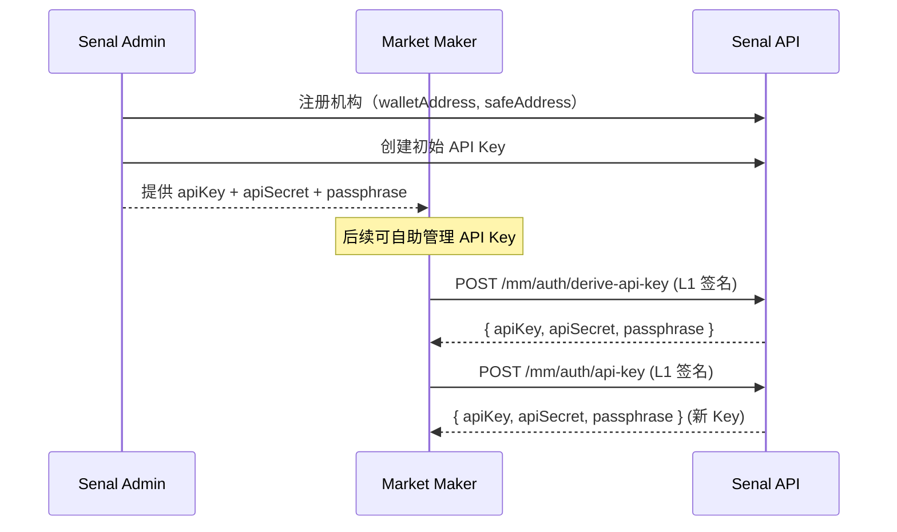

Senal 做市商 API 使用双层认证机制：

- **L1（钱包层）**：EIP-712 签名，用于身份验证和 API Key 管理
- **L2（请求层）**：HMAC-SHA256 签名，用于日常交易请求

## L2: HMAC-SHA256 Request Signing

大部分 API 请求使用 L2 认证。每个请求需携带 5 个 Headers：

| Header | Type | Description |
|--------|------|-------------|
| `SENAL-API-KEY` | string | API Key |
| `SENAL-SIGNATURE` | string | HMAC-SHA256 签名（hex） |
| `SENAL-TIMESTAMP` | string | 当前时间戳（毫秒） |
| `SENAL-NONCE` | string | 随机字符串，至少 16 字节 |
| `SENAL-PASSPHRASE` | string | API Key 关联的 Passphrase |

### Signature Algorithm

```
1. body_hash  = SHA256(request_body)        // 空 body 用空字符串
2. message    = timestamp + nonce + METHOD + path + body_hash
3. signature  = HMAC-SHA256(api_secret, message)
```

<Note>
  `path` 只包含路径部分，不含 query string。例如 `/v1/mm/orders` 而非 `/v1/mm/orders?page=1`。
</Note>

### Security Rules

- **时间窗口**：timestamp 必须在服务器时间 ±60 秒内
- **Nonce 防重放**：同一 API Key 的 nonce 在 300 秒内不可重复使用
- **Passphrase 常量时间比对**：防止时序攻击

## L1: EIP-712 Wallet Signing

L1 认证用于以下场景：
- `POST /mm/auth/api-key` — 创建新 API Key
- `POST /mm/auth/derive-api-key` — 派生 API Key

L1 请求使用 EIP-712 Typed Data 签名，Headers：

| Header | Type | Description |
|--------|------|-------------|
| `SENAL-ADDRESS` | string | 钱包地址（checksummed） |
| `SENAL-SIGNATURE` | string | EIP-712 签名 |
| `SENAL-TIMESTAMP` | string | 当前时间戳（**秒**） |
| `SENAL-NONCE` | string | 随机字符串 |

### EIP-712 Domain

```json
{
  "name": "SenalAuthDomain",
  "version": "1",
  "chainId": 56,
  "verifyingContract": "0x0000000000000000000000000000000000000000"
}
```

### EIP-712 Types

```json
{
  "SenalAuth": [
    { "name": "address", "type": "address" },
    { "name": "timestamp", "type": "string" },
    { "name": "nonce", "type": "string" },
    { "name": "message", "type": "string" }
  ]
}
```

### Message Value

```json
{
  "address": "<your-wallet-address>",
  "timestamp": "<unix-seconds>",
  "nonce": "<random-string>",
  "message": "This message attests that I control the given wallet"
}
```

### Example: Sign with ethers.js

```typescript
import { Wallet } from 'ethers';

const domain = {
  name: 'SenalAuthDomain',
  version: '1',
  chainId: 56,
  verifyingContract: '0x0000000000000000000000000000000000000000',
};

const types = {
  SenalAuth: [
    { name: 'address', type: 'address' },
    { name: 'timestamp', type: 'string' },
    { name: 'nonce', type: 'string' },
    { name: 'message', type: 'string' },
  ],
};

const timestamp = Math.floor(Date.now() / 1000).toString();
const nonce = crypto.randomUUID();

const value = {
  address: wallet.address,
  timestamp,
  nonce,
  message: 'This message attests that I control the given wallet',
};

const signature = await wallet.signTypedData(domain, types, value);
```

## API Key Lifecycle



<Warning>
  API Key 三元组（apiKey、apiSecret、passphrase）仅在创建时返回一次，请妥善保存。遗失后需联系管理员重置。
</Warning>
